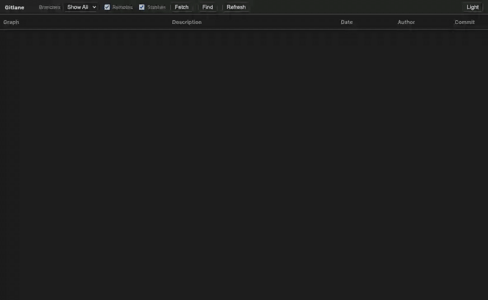

# Gitlane

本地 Git 提交图：在浏览器里看彩色泳道、提交详情和文件 diff，不依赖 VS Code。

绑定一个仓库、起一个 HTTP 服务即可。写入操作走 CSRF 保护的 `POST /api/action`。



## 运行

```bash
npm install
node src/cli.js /path/to/repo
# 或
npx gitlane /path/to/repo
# 或
npm start -- /path/to/repo --port 3840
```

服务会打印 URL（默认 `http://127.0.0.1:3840/`），并尝试打开系统浏览器。加 `--no-open` 可只启动服务。

```
gitlane <repo-path> [--port 3840] [--host 127.0.0.1] [--no-open]
```

## 界面

- 彩色泳道图 + 提交表（hash / 作者 / 日期 / 说明，带本地分支、远程分支、标签）
- 工作区有改动时显示 Uncommitted Changes 节点
- 单击提交：在该行下方展开详情与变更文件
- Ctrl/Cmd+单击第二个提交：比较
- 单击文件：页内 Monaco 左右 diff
- 右键提交 / 分支 / 远程 / 标签 / Stash / Uncommitted：checkout、branch、merge、rebase、reset、stash、push/fetch/pull 等
- 工具栏：分支过滤、Remotes/Stashes、Fetch、Find、Load More、亮/暗主题（跟随系统，可手动切换）
- 键盘：Ctrl/Cmd+F 查找，Ctrl/Cmd+R 刷新，Ctrl/Cmd+H 滚到 HEAD，方向键换详情，Esc 关闭

## 测试

```bash
npm test
```

## 许可

MIT。见 [LICENSE](LICENSE)。
